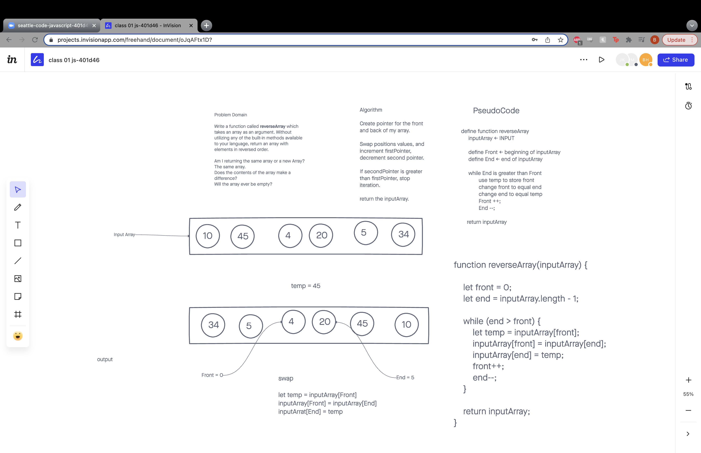

# Reverse an Array
Write a function called reverseArray which takes an array as an argument. Without utilizing any of the built-in methods available to your language, return an array with elements in reversed order.

## Whiteboard Process

## Approach & Efficiency
<!-- What approach did you take? Discuss Why. What is the Big O space/time for this approach? -->
The way that this reverse array algorithm is written results in a time complexity of O(n) but the space complexity is better(O(1)) because the reversal is being done in place as opposed to relying on a seperate temporary array.
