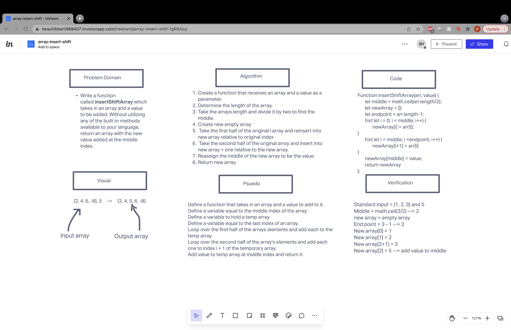

# Insert to Middle of an Array
Write a function called insertShiftArray which takes in an array and a value to be added. Without utilizing any of the built-in methods available to your language, return an array with the new value added at the middle index.

## Whiteboard Process

## Approach & Efficiency
The time complexity would be O(n) and the space complexity would be worse than O(1) because the transformation is not being done in place but instead with the use of a temporary array.
